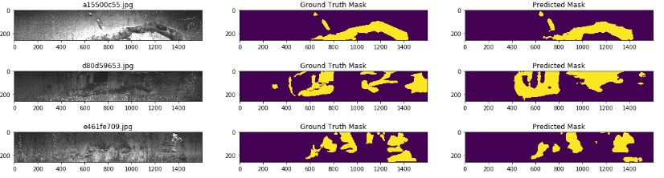
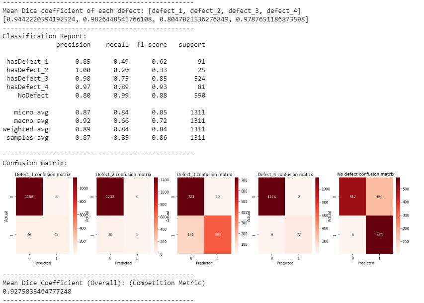
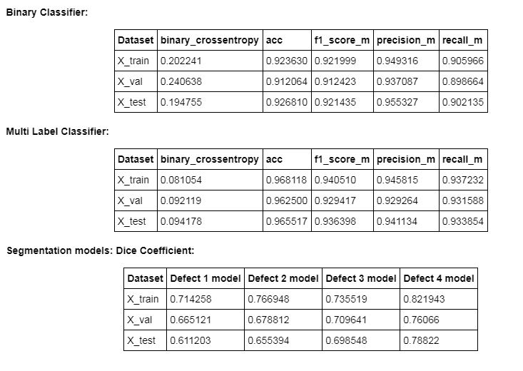
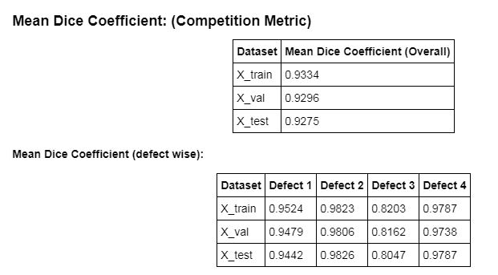

# steel-defect-detection
[Blog](https://medium.com/@guildbilla/steel-defect-detection-image-segmentation-using-keras-dae8b4f986f0?source=your_stories_page---------------------------)

**Main Notebooks:**
1) [Training.ipynb](https://github.com/rook0falcon/steel-defect-detection/blob/master/Training.ipynb)
2) [Inference.ipynb](https://github.com/rook0falcon/steel-defect-detection/blob/master/Inference.ipynb)

**Model Arch:**

 

**Evaluations on test set:** Test generated from raw_train set via train_test_split

